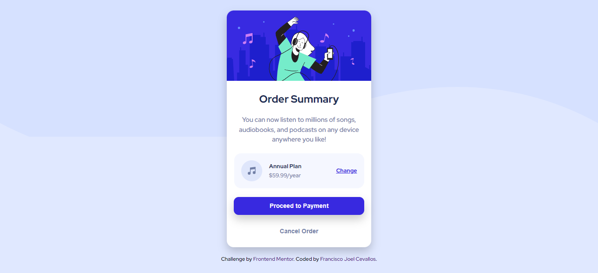
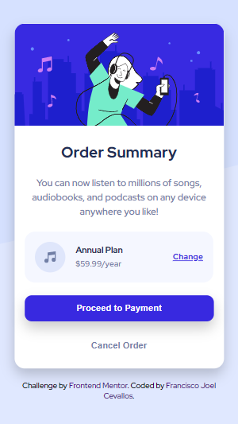

# Frontend Mentor - Order summary card solution

## Bienvenido! 👋

Esta es la solución al [Order summary card challenge on Frontend Mentor](https://www.frontendmentor.io/challenges/order-summary-component-QlPmajDUj). Práctico mis habilidades de desarrollo web con los desafíos de Frontend Mentor.

## Table of contents

- [Overview](#overview)
  - [The challenge](#the-challenge)
  - [Screenshot](#screenshot)
  - [Links](#links)
- [My process](#my-process)
  - [Built with](#built-with)
  - [What I learned](#what-i-learned)
- [Author](#author)


## Overview

### The challenge

Los usuarios deben ser capaces de ver el diseño ótimo del componente según el tamaño de pantalla de su dispositivo.

### Screenshot




### Links

- Live Site URL: [Add live site URL here](https://your-live-site-url.com)

## My process

### Built with

- Semantic HTML5 markup
- CSS custom properties
- Flexbox
- Mobile-first workflow


### What I learned

Aprendí el uso de módulo Flexbox, el cual me permite mejorar el desarrollo del desafío, ajustandose según el tamaño de pantalla del dispositivo de visualización.
A continuación, muestro algunos fragmentos de código que pude aplicar en este desafío.


```css
.main-container {
  display: flex;
  flex-direction: column;
  align-items: center;
  justify-content: center;
}
```

## Author

- Frontend Mentor - [@franciscojoel97](https://www.frontendmentor.io/profile/franciscojoel97)
- Twitter - [@FranciscoJoelC4](https://twitter.com/FranciscoJoelC4)

